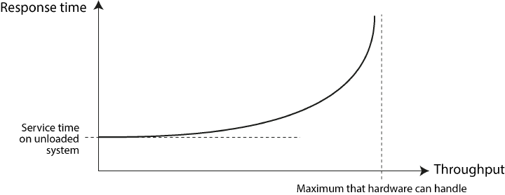
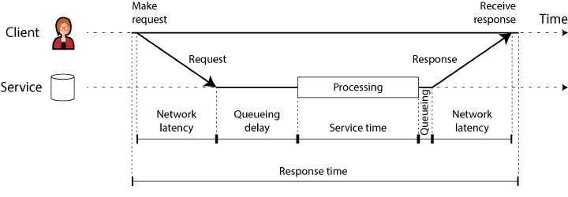

## Nonfunctional requirements - Performance

### Functional vs nonfunctional requirements?

Show answer

- **Functional** — *what* the app does: the screens, buttons, and operations that fulfill its purpose.
- **Nonfunctional** — *how well* it does it: 
  - **performance** (fast)
  - [**reliable**](1.4.2_Nonfunctional_Requirements.md) — keeps working correctly when things go wrong (fault tolerance).
  - [**scalable**](1.4.3_Nonfunctional_Requirements.md) — can add capacity efficiently as load grows.
  - [**maintainable**](1.4.4_Nonfunctional_Requirements.md) — stays easy to work on over time.
  - **security**
  - **compliance** (meets laws / regulations / standards)

### How is system performance measured?

Show answer

Two main metrics:

- [**Response time**](#what-is-response-time) — how long one request takes.
- [**Throughput**](#what-is-throughput) — how many requests the system handles per unit time. 

### What is response time?

Show answer

The elapsed time from when a user makes a request to when they receive the answer. 
Measured per request, in seconds (or ms / µs).

It is what a single user feels — the wait for one operation.

### What is throughput?

Show answer

The number of requests, or the volume of data, a system processes per unit time — "somethings per second."

For a fixed hardware allocation there is a **maximum throughput** the system can sustain; 
past it, requests can't be kept up with.

### How do throughput and response time relate?

Show answer

As load rises, response time rises with it — driven by **queueing**.
A busy system is often still handling an earlier request when a new one arrives, 
so the new request waits before it can even start.

At low load, response time is low. As throughput nears the hardware's maximum, the wait to get served grows sharply,
so queueing delays dominate the response time.

### What happens when a system nears overload?

Show answer

It can fall into a **vicious cycle** that makes it slower, and therefore even more overloaded. A long queue drives
response times up until clients time out and **resend** — which raises the request rate further and deepens the
backlog. This self-feeding loop is a **retry storm**.

The trap: the system can stay stuck in the overloaded state **even after the original load drops**, recovering only
after a reboot or reset. This is a **metastable failure** — the trigger is gone but the degraded state sustains
itself.

### How do you prevent overload from feeding itself?

Show answer

**Client-side — stop retries from piling on:**
- **Exponential backoff** — wait longer, and randomize, between successive retries.
- **Circuit breaker** — after recent errors or timeouts, temporarily stop sending to that service.
- **Token bucket** — cap the retry rate.

**Server-side — protect itself under pressure:**
- **Load shedding** — detect near-overload and proactively reject requests.
- **Backpressure** — signal clients to slow down.
- Choice of **queueing and load-balancing** algorithms.

### How do latency and response time differ?

Show answer

- **Response time** — what the client sees end to end: every delay anywhere in the system.
- **Service time** — the part where the service is actively working on the request.
- **Queueing delay** — waiting, not being worked on (e.g. for a free CPU, or for the outbound network to clear).
- **Latency** — catch-all for any time the request is *not* being actively processed — it sits latent. **Network
  latency** is the travel time of request and response through the network.

Relationship: **response time = service time + all the latency (queueing + network) around it.** 
Latency is the waiting; response time is the whole thing the client feels.

### How should response time be measured?

Show answer

Response time varies per request, so treat it as a **distribution**, never one number. 
Most requests are fast; a few outliers are far slower (jitter = variation in network delay).

- **Mean (average)** — sum ÷ count. Useful for estimating throughput limits, but a poor "typical" — it hides how many
  users actually felt that delay.
- **Median (p50)** — sort fastest→slowest, take the middle: half of requests are faster, half slower. The right metric
  for the *typical* wait.
- **High percentiles (p95, p99, p999)** — the **tail latencies**. p95 = 1.5 s means 5 in 100 requests took ≥ 1.5 s.
  These directly shape user experience, and the slowest requests often belong to the most valuable users (most data).

Conclusion: pick the percentile by business value. Amazon targets **p999** (1 in 1,000) but stops at **p9999** — the
extreme tail is dominated by random events outside your control, so cost rises while benefit falls off.

### How is expected service performance defined?

Show answer

Two ways to state expected performance/availability, often using percentiles:

- **SLO (service level objectives)** — the target itself. 
  E.g. median response < 200 ms, p99 < 1 s, and ≥ 99.9% of valid requests return non-error responses.
- **SLA (service level agreements)** — a contract specifying what happens **if the SLO is not met** 
  (e.g. the customer gets a refund).

So the SLO is the goal; the SLA is the goal plus consequences. 
Defining good availability metrics for either is harder than it looks in practice.

### How do you compute percentiles on live traffic?

Show answer

Keep a **rolling window** (e.g. the last 10 minutes of response times) and recompute the metrics each minute.

- **Exact** — store every response time in the window and sort it each minute. Simple, but costly at high volume.
- **Approximate** — use a sketch that estimates percentiles at low CPU/memory cost: HdrHistogram, t-digest,
  OpenHistogram, DDSketch.

Trap when combining data (across machines, or to coarsen the time resolution): **averaging percentiles is
mathematically meaningless.** Aggregate by **adding the histograms**, not by averaging the percentile values.

