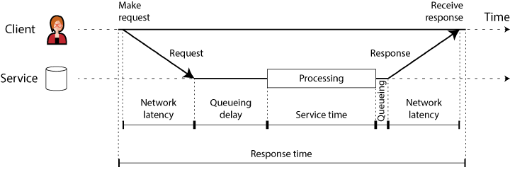

## Nonfunctional requirements - Performance

### Functional vs nonfunctional requirements?

Show answer

- **Functional** — *what* the app does: the screens, buttons, and operations that fulfill its purpose.
- **Nonfunctional** — *how well* it does it: 
  - [**performance**](#what-do-we-track-to-judge-performance) (fast)
  - [**reliable**](2.2_Nonfunctional_Requirements.md) — keeps working correctly when things go wrong (fault tolerance).
  - [**scalable**](2.3_Nonfunctional_Requirements.md) — can add capacity efficiently as load grows.
  - [**maintainable**](2.4_Nonfunctional_Requirements.md) — stays easy to work on over time.
  - **security**
  - **compliance** (meets laws / regulations / standards)

### What do we track to judge performance?

Show answer

Two main metrics:

- [**Response time**](#what-is-response-time) — how long one request takes.
- [**Throughput**](#what-is-throughput) — how many requests the system handles per unit time. 

### What is response time?

Show answer

The elapsed time from when a user makes a request to when they receive the answer. 
Measured per request, in seconds (or ms / µs).

It is what a single user feels — the wait for one operation.

### What are the components of response time?

Show answer

- **Response time** — what the client sees end to end: every delay anywhere in the system.
- **Service time** — the part where the service is actively working on the request.
- **Queueing delay** — waiting, not being worked on (e.g. for a free CPU, or for the outbound network to clear).
- **Latency** — catch-all for any time the request is *not* being actively processed — it sits latent. **Network
  latency** is the travel time of request and response through the network.

Relationship: **response time = service time + all the latency (queueing + network) around it.**
Latency is the waiting; response time is the whole thing the client feels.

### Latency vs response time — same thing?

Show answer

- **Strictly — no.** Response time is the whole wait the client sees. Latency is only the
  [waiting part](#what-are-the-components-of-response-time), when nothing is working on the request.
- **In practice — yes.** Dashboards (Datadog, Prometheus), design reviews and most engineers use the two words as one:
  "p99 latency" means the full end-to-end response time.

### What is throughput?

Show answer

The number of requests, or the volume of data, a system processes per unit time — "somethings per second."
It can't grow without limit: every system has a [maximum throughput](3.2.2_Managing_Throughput.md#what-is-maximum-throughput).

For a fixed hardware allocation there is a **maximum throughput** the system can sustain; 
past it, requests can't be kept up with.

**Capacity view:** with fixed resources, there is a [**maximum throughput**](3.2.2_Managing_Throughput.md#what-is-littles-law) the system can
sustain. The first resource to run out sets it — CPU, disk, network, or a software limit such as a connection pool.
Past it, requests arrive faster than they finish and [pile up in a queue](3.2.2_Managing_Throughput.md#how-do-throughput-and-response-time-relate).

