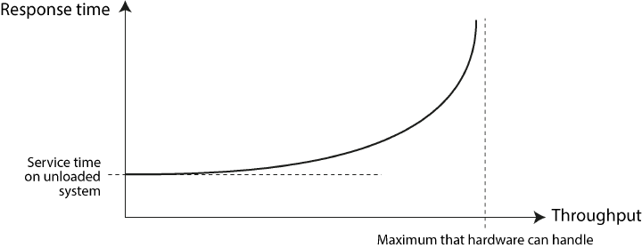

### What is maximum throughput?

Show answer

**Capacity view:** a system with fixed resources can handle only so many requests per second — its **maximum
throughput**. The first resource to run out (the bottleneck) sets it: CPU, disk, network, or a software limit such as
a database connection pool.

Past it, requests arrive faster than they finish, so the
[queue keeps growing](#how-do-throughput-and-response-time-relate).

### How do you raise maximum throughput?

Show answer

To raise the [maximum throughput](#what-is-maximum-throughput), fix the software or
[scale](2.3_Nonfunctional_Requirements.md):
- **Fix the software limit** — bigger pool, faster code. Per [Little's law](#what-is-littles-law) the maximum is
  N / d, so raise N or cut d.
- **Bigger machine** — scale up: move to a machine with more CPU cores, memory and faster disks. No code changes, but
  everything still runs on one machine.
- **More machines** — scale out. Once the biggest machine is not enough, this is the only way left.

### What is Little's law?

Show answer

In a stable system — load stays below the [maximum throughput](#what-is-throughput), so the queue doesn't grow without
end — on average:

**throughput = concurrency / response time** (λ = N / d)

- **Throughput (λ):** tasks finished per unit of time.
- **Concurrency (N):** tasks in progress at the same moment.
- [**Response time**](#what-is-response-time) **(d):** time for one task, from arrival to completion — working and
  waiting both count.

### How do throughput and response time relate?

Show answer

As load rises, response time rises with it — driven by **queueing**.
A busy system is often still handling an earlier request when a new one arrives,
so the new request waits before it can even start.

At low load, response time is low. As throughput nears the hardware's maximum, the wait to get served grows sharply,
so queueing delays dominate the response time.

### What happens when a system nears overload?

Show answer

Near the [maximum throughput](#what-is-maximum-throughput), the queue grows and
[response times rise sharply](#how-do-throughput-and-response-time-relate). From there it can fall into a
**vicious cycle** — each bad step causes the next, so it keeps getting worse:
- [**Retry storm**](#what-is-a-retry-storm) — it feeds itself: clients time out and resend, adding even more load.
- [**Metastable failure**](#what-is-a-metastable-failure) — it gets stuck: the overload stays even after traffic drops.

Both are [stopped from two sides](#how-do-you-prevent-overload-from-feeding-itself): clients retry less, servers drop
extra work.

### What is a retry storm?

Show answer

A loop that starts when a system gets slow:
- Near the [maximum throughput](#what-is-maximum-throughput), the queue grows and response times rise.
- Clients time out and **resend** their requests.
- The server now handles the old requests *plus* the resends, so the load jumps and the queue grows further.

Each step feeds the next — the system gets slower *because* it is slow.

### What is a metastable failure?

Show answer

A traffic spike ends, but the system stays overloaded and can't get out on its own. **Metastable** — once pushed into
the bad state, it stays there without the push.

Why it stays stuck:
- **Retries keep the load high.** A [retry storm](#what-is-a-retry-storm) keeps the request rate above the
  [maximum throughput](#what-is-maximum-throughput) even after real traffic falls.
- **The server works for nobody.** It is still processing old requests whose clients already gave up and resent.
  That work helps no one, so the queue never shrinks.

It recovers only when something breaks the loop: a restart that empties the queue, or
[cutting retries and dropping extra requests](#how-do-you-prevent-overload-from-feeding-itself).

### How do you prevent overload from feeding itself?

Show answer

Break the [vicious cycle](#what-happens-when-a-system-nears-overload) from both ends:
- [**Client side**](#how-does-the-client-stop-overload-feeding-itself)
- [**Server side**](#how-does-the-server-stop-overload-feeding-itself)

### How does the client stop overload feeding itself?

Show answer

Each client stops its [retries](#what-is-a-retry-storm) from adding more load:
- [**Exponential backoff with jitter**](#what-is-exponential-backoff-with-jitter) — wait longer after each failed
  try, plus a random delay so clients don't all retry at the same moment.
- [**Circuit breaker**](#what-is-a-circuit-breaker) — after too many failures, stop calling the service for a while.
- [**Retry budget**](#what-is-a-retry-budget) — cap how many retries are allowed, e.g. at most 10% of requests.

Handle: spread retries out, pause them, cap them.

### What is exponential backoff with jitter?

Show answer

A retry rule with two parts:
- **Exponential backoff** — double the wait after each failed try: 1 s, 2 s, 4 s, 8 s… Retries get rarer instead of
  hitting the overloaded service at full speed.
- **Jitter** — add a random amount to each wait. Without it, clients that failed together retry together, and every
  retry wave hits the server at the same moment (field term: *thundering herd*).

### What is a circuit breaker?

Show answer

A switch in the client that stops calls to a failing service. Named after the electric breaker: closed = current
flows.
- **Closed** — calls go through normally; failures are counted.
- **Open** — too many failures (e.g. 50% of recent calls): calls fail right away, without reaching the service.
- **Half-open** — after a wait, a few test calls go through. They succeed → closed again; they fail → open again.

The failing service gets a break from traffic and time to recover.

### What is a retry budget?

Show answer

A cap on how many retries a client may send, compared with its normal requests — e.g. retries may be at most 10% of
traffic. When the budget is used up, a failed request just fails; it is not retried.

One common way to build it: a **token bucket** — each retry spends a token, tokens refill at a fixed rate; no token,
no retry.

So even if every request fails, retries add at most 10% extra load — they can't double or triple it.

### How does the server stop overload feeding itself?

Show answer

The server keeps its load under the [maximum throughput](#what-is-maximum-throughput), so it can't
[get stuck](#what-is-a-metastable-failure):
- [**Load shedding**](#what-is-load-shedding) — near the limit, reject some requests right away (e.g. `503`).
- [**Backpressure**](#what-is-backpressure) — tell senders to slow down (e.g. `429` with a `Retry-After` header).
- [**Queue timeouts**](#what-is-a-queue-timeout) — drop queued requests that already waited longer than the client's
  timeout; nobody is waiting for the answer.

Handle: reject early, slow the senders, skip dead work.

### What is load shedding?

Show answer

The server rejects some requests on purpose when it is near its [maximum throughput](#what-is-maximum-throughput) —
right away, with a cheap error (e.g. `503 Service Unavailable`), instead of putting them in a queue.

Rejecting costs almost nothing. A queued request would only wait, time out at the client and come back as a retry.
So the server answers the requests it keeps at normal speed, instead of answering all of them too late.

### What is backpressure?

Show answer

The receiver controls how fast the sender may send. When the receiver falls behind, the sender has to slow down —
instead of the receiver's queue growing without end.

Examples:
- **Bounded queue** — when it is full, the producer blocks until there is room (Java `ArrayBlockingQueue.put()`).
- **Reactive Streams** — the consumer asks for the next N items with `request(n)`; the producer sends no more than
  that.
- **HTTP** — `429 Too Many Requests` with a `Retry-After` header tells the client when to come back.

### What is a queue timeout?

Show answer

The server drops a queued request once it has waited longer than the client is willing to wait. The client has
already given up — and maybe resent — so working on it helps nobody.

To know that limit, the client sends its **deadline** with the request (gRPC does this; field term: *deadline
propagation*). Before starting work, the server checks: deadline passed → drop the request.

This stops the server from [working for nobody](#what-is-a-metastable-failure) — the reason an overloaded system stays
stuck.

